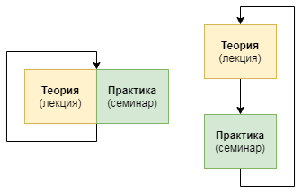

О структуре курса
---
Данный курс состоит из **проектов** - отдельных задач, которые команды должны решить с использованием различных теоретических знаний, которые они осваивают **параллельно** с их отработкой на практике

В отличие от "классической" структуры обучения с четко выделенными теоретическими (лекционными) и практическими (семинарскими) занятиями, данный подход имеет несколько преимуществ:
1. Теория не отнесена от практического закрепления на несколько дней, а закрепляется **"не отходя от кассы"**
2. Ученик, столкнувшийся со сложной проблемой, **мотивирован** освоить новые теоретические знания для ее решения
3. Данная модель подталкивает к самостоятельному освоению необходимого для решения задачи материала, а не использованию готовой теории
4. Обучающиеся получают опыт **командной работы**: учатся брать на себя ответственность, распределять роли и решать конфликты

Преподаватель в данной модели выполняет скорее роль *консультанта*, чем, собственно, преподавателя - делится своим опытом, проясняет сложные вопросы и так далее

